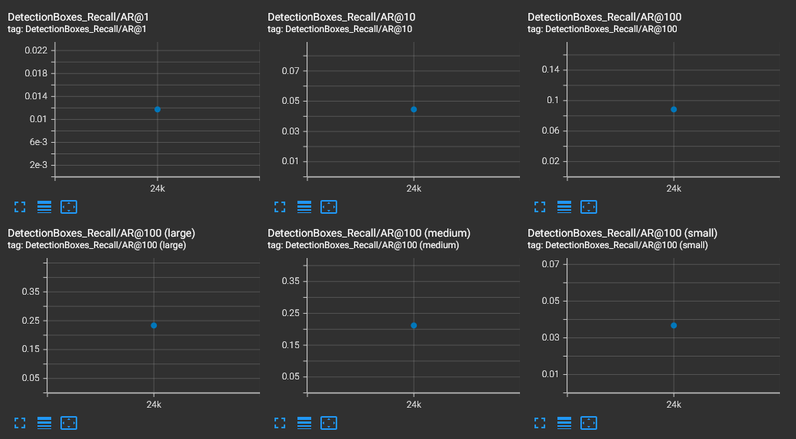

# Object Detection in an Urban Environment

The goal of this project is to train an object detection algorithm using data from the [Waymo Open dataset](https://waymo.com/open/).

The application could range from supplying addiquite information to a self-driving car system or say a stationary traffic surveillance system.

If you're uninterested in the 


## Setup

### Docker

This local setup only works with a NVIDIA GPU and you can use the provided Dockerfile and requirements in the [build directory](./build).

Follow [the README therein](./build/README.md) to create a docker container and install all prerequisites.

### Download and process the data
The first goal of this project is to download the data from the Waymo's Google Cloud bucket to your local machine. For this project, we only need a subset of the data provided (for example, we do not need to use the Lidar data). Therefore, we are going to download and trim immediately each file.

[OPTIONAL] - The files can be downloaded directly from the website as tar files or from the [Google Cloud Bucket](https://console.cloud.google.com/storage/browser/waymo_open_dataset_v_1_2_0_individual_files/) as individual tf records.

You can decide if you'd like to download the data inside the docker-container or outside the environment and mount the files inside the container, so it can be used there after. The latter will run faster, but will require you to mimic the requirments specified in the [Dockerfile](./build/Dockerfile) including the [Requirements.txt](./build/Requirements.txt).


 In `download_process.py`, you can view the `create_tf_example` function, which will perform this processing. This function takes the components of a Waymo Tf record and saves them in the Tf Object Detection api format. An example of such function is described [here](https://tensorflow-object-detection-api-tutorial.readthedocs.io/en/latest/training.html#create-tensorflow-records). We are already providing the `label_map.pbtxt` file.

If you wish to do it inside the docker container use the following:
```
cd /app/project/
python download_process.py --data_dir /app/project/data/ --size 100
```
If you wish to download the files outside the environment use:

You can run the script using the following command:
```
cd <your project folder>
python download_process.py --data_dir <your-project-folder>/data/ --size 100
```

The download and processing takes a while, so be patient! Once the script is done, you can look inside your `data_dir` folder to see if the files have been downloaded and processed correctly. At this point you should've have 100 files in your data/processed/ folder and none in the data/raw/ folder.

## Exploring the dataset
Now that we have processed data, we can explore!
Since the data is already present in `/app/project/data/processed/` directory we can explore the dataset! 

Unless you've altered the docker run command, the jupyter notebook server can be run with the following command:

```
jupyter notebook --ip=0.0.0.0 --allow-root
```

The notebook server can then be accesed at localhost:8888 on the docker-host.

In the Exploratory Data Analysis notebook you'll find a function that displays 10 random images (from the set of 100) along with a color coded bounding boxes for each of the objects in the image. (Red = vehicles, green = Pedestrian, blue = cyclists). Along with viewing the images, basic statistics of the dataset are provided.

A few examples:


Things to note at this point: 
1. We probably don't have equal classes
2. The weather and lighting will probably vary alot in the images.

Which leads us to investigate number of classes, images and image variability.


## Splitting the data: Train/val/test splits
Running the following command will split the data into three folders: 
1. data/train 
2. data/val 
3. dat/test

```
cd /app/project/
python create_splits.py --source /app/project/data/processed/ --destination /app/project/data/
```

We're setting aside 3 files for an unseen testing setting and splitting the remaining in a 80%/20% split for train and validation, respectively. The files are chosen randomly, so rerunning the command above will result in different files in the splits, but the ratio is kept the same.

Use the following command to run the script once your function is implemented:
```
python create_splits.py --data-dir /home/workspace/data
```


## Establishing a baseline

To establish a baseline we've chosen to use a SSD Resnet 50 640x640 model  without further preprocessing of the data. The pretrained model used for baseline performance needs to be downloaded into the pretrained folder in experiements/.

Execute the following to do so:
```
cd /app/project/experiments/pretrained_model/

wget http://download.tensorflow.org/models/object_detection/tf2/20200711/ssd_resnet50_v1_fpn_640x640_coco17_tpu-8.tar.gz

tar -xvzf ssd_resnet50_v1_fpn_640x640_coco17_tpu-8.tar.gz

rm -rf ssd_resnet50_v1_fpn_640x640_coco17_tpu-8.tar.gz
```
The config file running the pipeline above is already present in `experiments/reference/baseline.config`

But should you need to recreate the config file run the following:
```
python edit_config.py --train_dir /app/project/data/train/ --eval_dir /app/project/data/val/ --batch_size 2 --checkpoint /app/project/experiments/pretrained_model/ssd_resnet50_v1_fpn_640x640_coco17_tpu-8/checkpoint/ckpt-0 --label_map /app/project/experiments/label_map.pbtxt
```
This will produce a new config file called `pipeline_new.config`. Rename and move the file to the `experiments/reference/` folder.

### Training
To launch a training process with the config file from above use the following:
```
python experiments/model_main_tf2.py --model_dir=experiments/reference/ --pipeline_config_path=experiments/reference/baseline.config
```
Once the training is finished, launch the evaluation process:
```
python experiments/model_main_tf2.py --model_dir=experiments/reference/ --pipeline_config_path=experiments/reference/baseline.config --checkpoint_dir=experiments/reference/
```

**Note**: Both processes will display some Tensorflow warnings, which can be ignored. You may have to kill the evaluation script manually using
`CTRL+C`.

To monitor the training, you can launch a tensorboard instance by running:

```
python -m tensorboard.main --logdir experiments/reference/ --host 0.0.0.0
```
You can now access the tensorboard from the docker-host at localhost:6006.

### Results
This section should detail the results of the reference experiment. It should includes training metrics and a detailed explanation of the algorithm's performances.




## Improve the performance

Most likely, this initial experiment did not yield optimal results. However, you can make multiple changes to the config file to improve this model. One obvious change consists in improving the data augmentation strategy. The [`preprocessor.proto`](https://github.com/tensorflow/models/blob/master/research/object_detection/protos/preprocessor.proto) file contains the different data augmentation method available in the Tf Object Detection API. To help you visualize these augmentations, we are providing a notebook: `Explore augmentations.ipynb`. Using this notebook, try different data augmentation combinations and select the one you think is optimal for our dataset. Justify your choices in the writeup.


The following augmentations were added:

  data_augmentation_options {
    random_rgb_to_gray {
      probability: 0.2
    }
  }
  data_augmentation_options {
    random_black_patches {
      size_to_image_ratio: 0.05
    }
  }
  data_augmentation_options {
    random_jitter_boxes {
    }
  }
  data_augmentation_options {
    random_adjust_brightness {
    }
  }


Upping the batch size to 3
added number of steps to 30000


**Important:** If you are working on the workspace, your storage is limited. You may to delete the checkpoints files after each experiment. You should however keep the `tf.events` files located in the `train` and `eval` folder of your experiments. You can also keep the `saved_model` folder to create your videos.

### Training
To launch a training process with the config file from above use the following:
```
python experiments/model_main_tf2.py --model_dir=experiments/experiment1/ --pipeline_config_path=experiments/experiment1/pipeline_new.config
```
Once the training is finished, launch the evaluation process:
```
python experiments/model_main_tf2.py --model_dir=experiments/experiment1/ --pipeline_config_path=experiments/experiment1/pipeline_new.config --checkpoint_dir=experiments/experiment1/
```

### Results


### Creating an animation
#### Export the trained model
Modify the arguments of the following function to adjust it to your models:

```
python experiments/exporter_main_v2.py --input_type image_tensor --pipeline_config_path experiments/experiment1/pipeline_new.config --trained_checkpoint_dir experiments/experiment1/ --output_directory experiments/experiment1/exported/
```

This should create a new folder `experiments/reference/exported/saved_model`. You can read more about the Tensorflow SavedModel format [here](https://www.tensorflow.org/guide/saved_model).

Finally, you can create a video of your model's inferences for any tf record file. To do so, run the following command (modify it to your files):


```
python inference_video.py --labelmap_path label_map.pbtxt --model_path experiments/experiment1/exported/saved_model --tf_record_path /app/project/data/test/segment-11060291335850384275_3761_210_3781_210_with_camera_labels.tfrecord --config_path experiments/experiment1/pipeline_new.config --output_path animation.gif
```


## Results
This section should highlight the different strategies you adopted to improve your model. It should contain relevant figures and details of your findings.
